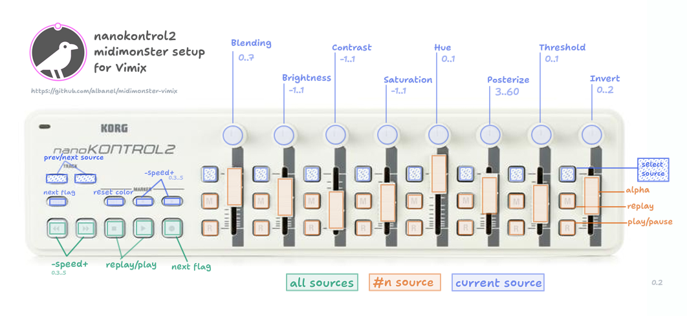

# midimonster-vimix
 Config files to map Korg nanoKONTROL2 midi controller to Vimix video mixer via OSC protocol

This setup allows to control some of the features of [Vimix](https://github.com/brunoherbelin/vimix) video software, like mixing, color or speed, by handling the knobs, faders and buttons of the Korg nanoKONTROL2 controller. The [midimonster](https://github.com/cbdevnet/midimonster/) config files translate the midi messages sent by the Korg controller to the OSC commands needed by Vimix. 

The faders, R and M buttons of the nanoKONTROL2 control the transparency and playback of the first eight video sources of the Vimix session. The S buttons allow to select a source and then change some of its color settings (blending, brightness, contrast, saturation, hue, posterize, threshold and invert) with the top knobs. The left group of buttons can play, pause and change the speed of current or all sources. MIDIMonster config files manage the range of values of each input/output channel according to nanoKONTROL2 scene template, [Vimix OSC API](https://github.com/brunoherbelin/vimix/wiki/Open-Sound-Control-API) and personal preferences. See sketch or comments on config file. 

To use this, install MIDIMonster library, connect the nanoKONTROL2 to the computer via USB, launch Vimix with default OSC configs (7000 port in, 7001 por out) and then run `midimonster vimix-controllers.cfg` Vimix should begin reacting to nanoKONTROL2 interactions.

## Files included

- [vimix.nnktrl2_data](https://github.com/pilarmera/midimonster-vimix/blob/main/vimix.nktrl2_data): scene file for nanoKONTROL2, loaded to the device using the Korg Kontrol Editor.
- [vimix-controllers.cfg](https://github.com/pilarmera/midimonster-vimix/blob/main/vimix-controllers.cfg): MIDIMonster config file with midi-osc mappings.
- [functions.lua](https://github.com/pilarmera/midimonster-vimix/blob/main/functions.lua): lua script with helper functions called by config file.

## Requirements

- [Vimix](https://brunoherbelin.github.io/vimix/) live video mixer software. Available for Linux and Mac.
- [MIDIMonster](https://midimonster.net/) library 
- [Korg nanoKONTROL2](https://www.korg.com/us/products/computergear/nanoKONTROL2/) physical controller (and [Korg Kontrol Editor](https://www.korg.com/us/support/download/software/0/159/1354/) to load scene template file).

To-do:

- Fix reset behaviour ("set" button)
- Manage batches and user selections
- Enable external LED mode on nanoKONTROL2 
- Integrate with other controllers, like Akai MPK Mini MK3

Some issues:
- MIDIMonster forces all osc patterns to have at least one argument, so messages like vimix/current/flag to jump to next flag are not working (they overlaps with `vimix/current/flag {flag_index}`)
- MIDIMonster only allows values of the type i, f, h, d. You can't send a string as an argument (i.e. `/current/{source_name}`)
- MIDIMonster considers '#' character as illegal, so messages like `/batch/#0` are not allowed.  